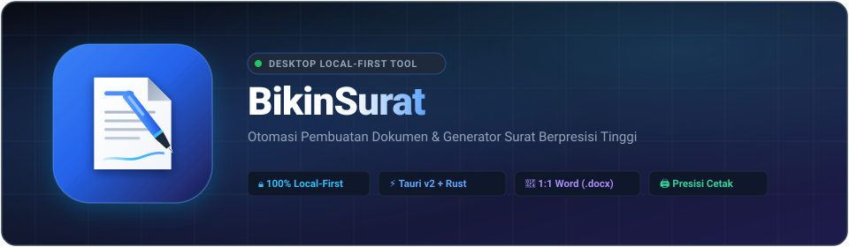
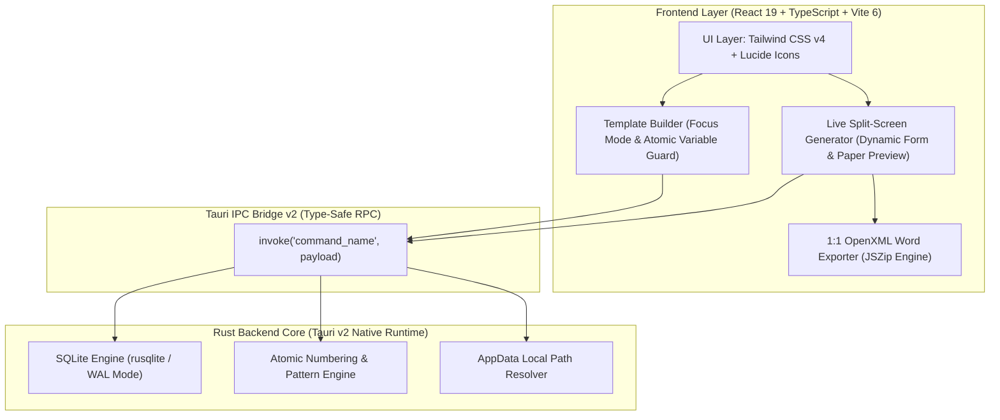

<div align="center">



<br />
<br />

<p align="center">
  <a href="https://tauri.app/"></a>&nbsp;
  <a href="https://react.dev/"></a>&nbsp;
  <a href="https://www.typescriptlang.org/"></a>&nbsp;
  <a href="https://www.rust-lang.org/"></a>&nbsp;
  <a href="https://tailwindcss.com/"></a>&nbsp;
  <a href="https://www.sqlite.org/"></a>&nbsp;
  <a href="LICENSE"></a>&nbsp;
  <a href="#-keamanan--privasi-100-local-first"></a>
</p>

*Solusi penerbitan surat dinas, surat tugas, permohonan cuti, hingga paklaring secara cepat, konsisten, dan aman tanpa risiko kebocoran data organisasi ke cloud.*

[Fitur Utama](#-fitur-utama) • [Arsitektur](#-arsitektur-sistem) • [Panduan Memulai](#-panduan-memulai) • [Pintasan Keyboard](#-tabel-pintasan-keyboard) • [Keamanan](#-keamanan--privasi-100-local-first) • [Kontribusi](#-lisensi--atribusi)

---

</div>

## 📌 Mengapa BikinSurat?

Di lingkungan perkantoran dan instansi, penyusunan surat resmi sering terhambat oleh:
- **Resiko Privasi**: Menggunakan konverter web/cloud pihak ketiga rawan membocorkan data pribadi (PII), nomor identitas, dan informasi rahasia internal.
- **Format Berantakan**: Mengedit berkas `.docx` mentah secara berulang kerap merusak kerapian margin, font, tata letak tabel, dan tanda tangan.
- **Pemborosan Waktu**: Mengganti variabel surat (nama, tanggal, nomor surat) satu per satu secara manual sangat rawan *human error*.
- **Aplikasi Lambat & Berat**: Pengolah kata raksasa boros memori (RAM > 500 MB) dan lambat saat dibuka.

**BikinSurat** hadir memecahkan semua persoalan di atas dengan pendekatan **Modern Desktop & 100% Local-First** — menghadirkan kinerja instan (< 1.2 detik), penggunaan memori ultra-rendah (< 85 MB RAM), serta integrasi form dinamis ke pratinjau lembar naskah fisik secara *real-time*.

---

## ✨ Fitur Utama

### 📝 1. Live Split-Screen Document Generator
- **Auto-Discovery Variable Fields**: Templat otomatis dipetakan menjadi formulir isian terstruktur di panel kiri (teks, paragraf, tanggal, angka, dropdown pilihan, dan format rupiah `Rp` otomatis).
- **Pratinjau Fisik Real-time**: Perubahan pada isian langsung ter-render seketika pada lembar kertas dokumen sisi kanan.
- **Pemisah Fleksibel (*Resizable Split Divider*)**: Geser batas panel sesuai kenyamanan layar kerja Anda.
- **Smart Recipient Auto-Detection**: Deteksi cerdas nama pemohon/penerima surat langsung ke buku riwayat tanpa pengisian berulang.

### 🖋️ 2. Template Builder Mode Fokus (Word-like Experience)
- **Editor Naskah Cepat**: Dilengkapi sticky toolbar, kontrol jenis font (*Times New Roman*, *Arial*, *Calibri*, *Georgia*, *Courier New*), ukuran teks, dan penyisipan tabel.
- **Tab Key Indentation**: Tombol `Tab` secara cerdas mengindentasi 4 spasi (`&nbsp;&nbsp;&nbsp;&nbsp;`) alih-alih melompatkan kursor keluar editor.
- **Atomic Variable Protection**: Klik pada tag variabel memilih seluruh blok `{{kunci}}` sekaligus (`user-select: all`). Anda dapat langsung menebalkan (`Ctrl+B`) atau menghapus tag tanpa takut kurung kurawal terpotong.
- **Pengaturan Kertas Dinamis**: Pilihan format kertas **A4**, **F4**, **Letter** dengan orientasi **Tegak (Portrait)** maupun **Mendatar (Landscape)** serta pengaturan margin (mm).
- **Zoom Kontrol Presisi**: Fitur Zoom In (+), Zoom Out (-), dan Reset (100%) pada kanvas editor maupun pratinjau surat.

### 📄 3. Ekspor Microsoft Word (.docx) Berpresisi 1:1
- Generator berkas OpenXML asli yang menghasilkan dokumen `.docx` berstandar WordprocessingML murni.
- **Sinkronisasi Format Penuh**: Pemetaan akurat untuk ukuran font, keluarga huruf, warna teks, efek coret (*strikethrough*), teks tebal, miring, garis bawah, perataan paragraf, dan indentasi tabel.
- **Dynamic Signature Alignment**: Indentasi blok tanda tangan kanan dihitung secara dinamis, menjamin penanggalan dan nama pejabat tidak memotong baris secara canggung di Microsoft Word.

### 🖨️ 4. Isolasi Cetak & Ekspor PDF Bebas Gangguan
- Aturan ketat `@media print` yang mengisolasi lembar naskah `.document-paper`.
- Secara otomatis menyembunyikan bilah formulir, header, sidebar, dan tombol kontrol saat dialog cetak printer fisik atau *Save as PDF* dibuka.
- **Jaminan Kertas Putih Murni**: Kertas pratinjau surat digital selalu tampil dengan latar Putih Murni (`#FFFFFF`) dan teks Hitam Pekat (`#000000`) demi akurasi hasil cetak di printer fisik, baik pada mode terang maupun gelap.

### 🔢 5. Penomoran Dokumen Atomik & Siklus Draf
- **Multi-Pattern Support**: Dukungan pola penomoran mandiri per templat dengan tag fleksibel: `{COUNTER}`, `{BULAN_ROMAWI}`, `{MM}`, `{YYYY}`, `{YY}` (misal: `001/SPT-OPS/IX/2026`).
- **Nomor Tidak Terbakar Saat Draf**: Draf surat disimpan terpisah. Selama status dokumen draf (`[DRAF - BELUM TERBIT]`), counter nomor urut resmi instansi tidak terpakai hingga surat benar-benar diterbitkan (dicetak/diekspor).
- **Laci Draf Tersimpan**: Buka, revisi, atau hapus draf naskah kapan saja dengan aman.

### 📜 6. Riwayat Dokumen Lengkap & Fitur "Isi Ulang" (*Re-populate*)
- Audit log otomatis mencatat setiap penerbitan surat lengkap dengan waktu lokal komputer (`datetime('now', 'localtime')`).
- **Fitur 1-Klik Isi Ulang**: Ingin membuat surat serupa atau merevisi surat sebelumnya? Cukup klik ikon **Isi Ulang**, seluruh form langsung terisi otomatis sesuai riwayat masa lalu.

### 🛡️ 7. Perlindungan Kehilangan Data (*Unsaved Changes Guard*)
- Dialog modal konfirmasi pintar saat Anda hendak keluar dari formulir atau editor templat jika terdapat perubahan naskah yang belum disimpan (pilihan: *Tetap Keluar*, *Simpan Draf*, atau *Batal untuk Melanjutkan*).

### 🌓 8. Corporate Sharp Design & Mode Gelap
- Tampilan modern bergaris tegas (*corporate sharp*) dengan sudut `rounded-sm` (2px - 4px) yang elegan.
- Dukungan Tema Terang (*Light Mode*) dan Gelap (*Dark Mode*) melalui pintasan cepat `Ctrl + Shift + D` atau tombol sidebar.
- Pintasan terpisah: `Ctrl + \` untuk melipat sidebar, membebaskan `Ctrl + B` sepenuhnya untuk menebalkan teks di editor.

---

## 🏗️ Arsitektur Sistem

BikinSurat dibangun menggunakan arsitektur modular yang memadukan kecepatan **Rust** pada backend native dengan kelincahan **React 19 & TypeScript** pada frontend:



### Stack Teknologi

| Komponen               | Teknologi                                                                      | Keterangan                                                                         |
| :--------------------- | :----------------------------------------------------------------------------- | :--------------------------------------------------------------------------------- |
| **Desktop Shell**      | [Tauri v2](https://v2.tauri.app/)                                              | Runtime native Rust berukuran sangat kecil (~12 MB binary) & konsumsi memori minim |
| **Frontend Framework** | [React 19](https://react.dev/) + [TypeScript](https://www.typescriptlang.org/) | Reaktivitas modern, optimasi render, dan keamanan tipe data ketat                  |
| **Styling & Design**   | [Tailwind CSS v4](https://tailwindcss.com/)                                    | Engine CSS performa tinggi dengan *modern sharp design language*                   |
| **Basis Data Lokal**   | [SQLite 3](https://www.sqlite.org/) via `rusqlite`                             | Penyimpanan lokal ACID-compliant dalam mode WAL (*Write-Ahead Logging*)            |
| **Word Exporter**      | [JSZip](https://stuk.github.io/jszip/) + Custom OpenXML                        | Generator berkas `.docx` valid berstandar Microsoft WordprocessingML               |
| **Ikonografi**         | [Lucide React](https://lucide.dev/)                                            | Kumpulan ikon minimalis, elegan, dan konsisten                                     |

---

## ⌨️ Tabel Pintasan Keyboard

Tingkatkan kecepatan kerja Anda dengan berbagai kombinasi tombol cepat:

| Pintasan Keyboard            | Aksi / Fungsi                                              | Ruang Lingkup      |
| :--------------------------- | :--------------------------------------------------------- | :----------------- |
| `Ctrl + \`                   | Buka / Lipat Bilah Navigasi (*Sidebar*)                    | Global Aplikasi    |
| `Ctrl + Shift + D`           | Ganti Tema (Mode Terang / Mode Gelap)                      | Global Aplikasi    |
| `Ctrl + P`                   | Buka Dialog Cetak Printer / Ekspor ke PDF                  | Pembuat Surat      |
| `Ctrl + S`                   | Simpan Perubahan Templat / Simpan Draf Cepat               | Editor & Generator |
| `Ctrl + B`                   | Menebalkan Teks (*Bold*)                                   | Editor Templat     |
| `Ctrl + I`                   | Memiringkan Teks (*Italic*)                                | Editor Templat     |
| `Ctrl + U`                   | Menggarisbawahi Teks (*Underline*)                         | Editor Templat     |
| `Ctrl + L` / `E` / `R` / `J` | Perataan Kiri, Tengah, Kanan, Rata Kanan-Kiri              | Editor Templat     |
| `Ctrl + Z` / `Ctrl + Y`      | Undo / Redo Riwayat Pengetikan                             | Editor Templat     |
| `Tab`                        | Menyisipkan Indentasi 4 Spasi (`&nbsp;&nbsp;&nbsp;&nbsp;`) | Editor Templat     |

---

## 🚀 Panduan Memulai

### Prasyarat Sistem
Pastikan perangkat Anda telah terpasang:
1. **Node.js** versi 18.x atau lebih baru ([Unduh Node.js](https://nodejs.org/))
2. **Rust & Cargo** versi terbaru ([Unduh Rust](https://www.rust-lang.org/tools/install))
3. **C++ Build Tools**:
   - **Windows**: Microsoft C++ Build Tools (via Visual Studio Installer)
   - **macOS**: Xcode Command Line Tools (`xcode-select --install`)
   - **Linux**: `build-essential`, `libwebkit2gtk-4.1-dev`, `libssl-dev`, `libayatana-appindicator3-dev`

### Instalasi & Menjalankan Proyek

1. **Kloning Repositori**:
   ```bash
   git clone https://github.com/DimasAdiNugroho-dryTundra/BikinSurat.git
   cd BikinSurat
   ```

2. **Pasang Dependensi**:
   ```bash
   npm install
   ```

3. **Jalankan Aplikasi Desktop (Mode Pengembangan)**:
   ```bash
   npx tauri dev
   ```
   *Aplikasi Tauri desktop akan terbuka secara otomatis dengan fitur Hot-Module-Replacement (HMR).*

4. **Jalankan Frontend di Peramban Web (Opsional / Mock IPC)**:
   ```bash
   npm run dev
   ```
   *Catatan: Periksa URL lokal (Local: http://localhost:xxxx/) yang dicetak Vite di terminal Anda saat server dijalankan.*

5. **Build Aplikasi Produksi**:
   ```bash
   npx tauri build
   ```
   *Paket installer desktop mandiri (`.msi` / `.exe` untuk Windows) akan dihasilkan di folder `src-tauri/target/release/bundle/`.*

---

## 🔒 Keamanan & Privasi 100% Local-First

Keamanan data organisasi adalah prioritas utama rancangan BikinSurat:
- **Zero-Network Architecture**: Aplikasi tidak memiliki endpoint telemetri, analitik eksternal, atau koneksi ke peladen cloud pihak ketiga.
- **Penyimpanan Lokal Eksklusif**: Seluruh data templat, draf, riwayat, dan profil instansi tersimpan di komputer Anda pada berkas SQLite:
  - **Windows**: `%APPDATA%\com.bikinsurat.desktop\database\basisdata_bikinsurat.db`
  - **macOS**: `~/Library/Application Support/com.bikinsurat.desktop/database/`
  - **Linux**: `~/.local/share/com.bikinsurat.desktop/database/`
- **Air-Gapped Ready**: Dapat dioperasikan penuh pada jaringan intranet terisolasi atau perangkat komputer tanpa sambungan internet sama sekali.

---

## 📂 Struktur Direktori Proyek

```text
BikinSurat/
├── public/                 # Aset publik statis (banner.svg, logo.svg, favicon)
├── src/                    # Kode sumber antarmuka frontend React
│   ├── components/         # Komponen UI modular
│   │   ├── layout/         # Header, Sidebar, BrandLogo
│   │   └── theme/          # ThemeProvider (Dark/Light mode)
│   ├── lib/                # Layanan logika & utilitas
│   │   ├── docxExport.ts   # 1:1 High-Fidelity Word (.docx) Exporter
│   │   ├── ipc.ts          # Tauri IPC bridge & fallback mock browser
│   │   └── utils.ts        # Helper manipulasi string & styling
│   ├── views/              # Tampilan halaman utama
│   │   ├── GeneratorView.tsx    # Pembuat Surat (Split-screen live preview)
│   │   ├── BuilderFocusView.tsx # Editor Templat (Word-like focus canvas)
│   │   ├── HistoryView.tsx      # Riwayat Dokumen & Audit Log
│   │   └── SettingsView.tsx     # Pengaturan Profil Instansi & Nomor Surat
│   ├── types.ts            # Definisi tipe data TypeScript
│   ├── App.tsx             # Root layout & view controller
│   ├── main.tsx            # Entry point aplikasi React
│   └── index.css           # Styling Tailwind CSS v4 & @media print rules
├── src-tauri/              # Backend desktop Tauri v2 (Rust)
│   ├── icons/              # Ikon aplikasi multi-platform (.ico, .icns, .png)
│   ├── src/                # Kode sumber Rust
│   │   ├── commands.rs     # Handler perintah Tauri IPC & SQLite logic
│   │   ├── db.rs           # Inisialisasi basis data, migrasi & initial seeds
│   │   ├── lib.rs          # Entry point Tauri runtime
│   │   └── main.rs         # Binary launcher
│   ├── Cargo.toml          # Dependensi crate Rust
│   └── tauri.conf.json     # Konfigurasi jendela & metadata aplikasi Tauri
├── .gitignore              # Proteksi privasi & filter berkas sensitif
├── LICENSE                 # Lisensi terbuka MIT License
├── package.json            # Konfigurasi npm & dependensi frontend
└── README.md               # Dokumentasi resmi proyek
```

---

## 👨‍💻 Lisensi & Atribusi

Dikembangkan dengan dedikasi oleh **[DimasAdiNugroho-dryTundra](https://github.com/DimasAdiNugroho-dryTundra)**.

Proyek ini dirilis dan didistribusikan secara terbuka di bawah lisensi **[MIT License](LICENSE)**. 

Hak Cipta © 2026 **BikinSurat** by Dimas Adi Nugroho.
Anda bebas untuk menggunakan, menyalin, memodifikasi, menggabungkan, menerbitkan, mendistribusikan, mensublisensikan, dan/atau menjual salinan perangkat lunak ini untuk keperluan personal, operasional kantor, maupun komersial, dengan tetap menyertakan pemberitahuan hak cipta asli.

